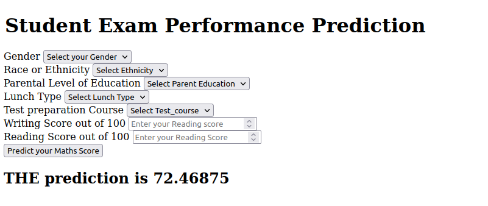

# Student Test Score Prediction

### Introduction About the Data :

**Source**

Dataset Source - https://www.kaggle.com/datasets/spscientist/students-performance-in-exams?datasetId=74977
The data consists of 8 column and 1000 rows.

**The dataset** The goal is to predict `marks` of given student (Regression Analysis).

There are 7 independent variables (including `id`):

- `gender` : sex of students  -> (Male/female)
- `race/ethnicity` : ethnicity of students -> (Group A, B,C, D,E)
- `parental level of education` : parents' final education ->(bachelor's degree,some college,master's degree,associate's degree,high school)
- `lunch` : having lunch before test (standard or free/reduced) 
- `test preparation course` : complete or not complete before test
- `reading score`
- `writing score`

Target variable:
* `math score`: Price of the given Diamond.

# AWS Deployment Link :

AWS Elastic Beanstalk link : [http://studentperfomance-env.eba-pn7btpgm.ap-south-1.elasticbeanstalk.com/predictdata]

# Screenshot of UI

# Approach for the project 

1. Data Ingestion : 
    * In Data Ingestion phase the data is first read as csv. 
    * Then the data is split into training and testing and saved as csv file.

2. Data Transformation : 
    * In this phase a ColumnTransformer Pipeline is created.
    * for Numeric Variables first SimpleImputer is applied with strategy median , then Standard Scaling is performed on numeric data.
    * for Categorical Variables SimpleImputer is applied with most frequent strategy, then ordinal encoding performed , after this data is scaled with Standard Scaler.
    * This preprocessor is saved as pickle file.

3. Model Training : 
    * In this phase base model is tested . The best model found was Linear regresion.
    * This model is saved as pickle file.

4. Prediction Pipeline : 
    * This pipeline converts given data into dataframe and has various functions to load pickle files and predict the final results in python.

5. Flask App creation : 
    * Flask app is created with User Interface to predict the gemstone prices inside a Web Application.

# Exploratory Data Analysis Notebook

Link : [EDA Notebook](./notebook/1%20.%20EDA%20STUDENT%20PERFORMANCE%20.ipynb)

# Model Training Approach Notebook

Link : [Model Training Notebook](./notebook/2.%20MODEL%20TRAINING.ipynb)
